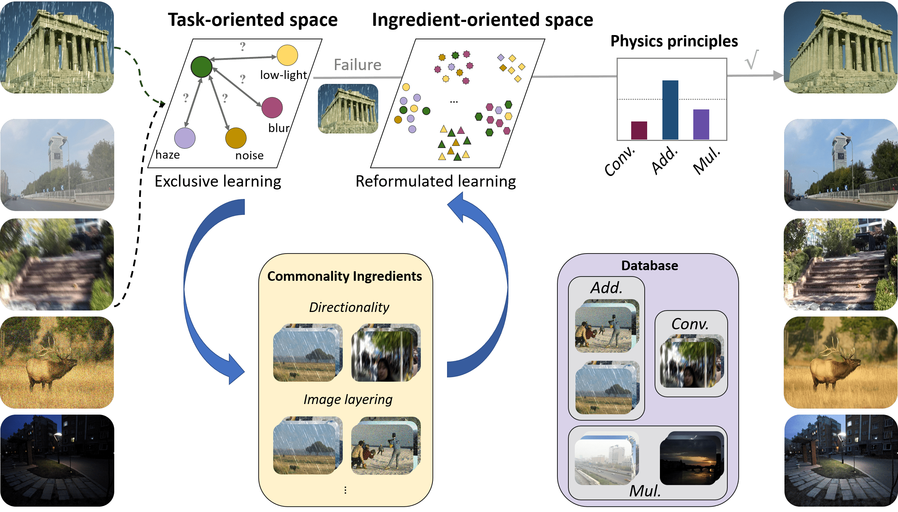

# Ingredient-oriented Multi-Degradation Learning for Image Restoration

This repository contains the official implementation of the CVPR 2023 paper [Ingredient-oriented Multi-Degradation Learning for Image Restoration](https://openaccess.thecvf.com/content/CVPR2023/papers/Zhang_Ingredient-Oriented_Multi-Degradation_Learning_for_Image_Restoration_CVPR_2023_paper.pdf). 

## Abstract
>Learning to leverage the relationship among diverse image restoration tasks is quite beneficial for unraveling the intrinsic ingredients behind the degradation. Recent years have witnessed the flourish of various All-in-one methods, which handle multiple image degradations within a single model. In practice, however, few attempts have been made to excavate task correlations in that exploring the underlying fundamental ingredients of various image degradations, resulting in poor scalability as more tasks are involved. In this paper, we propose a novel perspective to delve into the degradation via an ingredients-oriented rather than previous task-oriented manner for scalable learning. Specifically, our method, named Ingredients-oriented Degradation Reformulation framework (IDR), consists of two stages, namely task-oriented knowledge collection and ingredients-oriented knowledge integration. In the first stage, we conduct ad hoc operations on different degradations according to the underlying physics principles, and establish the corresponding prior hubs for each type of degradation. While the second stage progressively reformulates the preceding task-oriented hubs into single ingredients-oriented hub via learnable Principal Component Analysis (PCA), and employs a dynamic routing mechanism for probabilistic unknown degradation removal. Extensive experiments on various image restoration tasks demonstrate the effectiveness and scalability of our method. More importantly, our IDR exhibits the favorable generalization ability to unknown downstream tasks.



## Requirements
A suitable [conda](https://conda.io/) environment named `IDR` can be created
and activated with:

```
conda env create -f environment.yaml
conda activate IDR
```


## Data preparing
- Create the .txt file for your dataset, and put the txt file to the docs folder. Note that you may create multiple ./txt files for multiple datasets.
    ```
    python -u create_txt.py \
    --input input_path \
    --target target_path \
    --output ./docs/train/datasetname.txt \
    ```
    
- The data structure is like this:
  ```
  dataset
  ├── input
  │  ├── xxx.jpg
  │  ├── ...
  ├── target
  │  ├── xxx.jpg
  │  ├── ...
  ```
- Make sure the paths of the created .txt files have been modified in the `./config/IDR-restormer.yml`. You can also specify arbitrary subset of training tasks by configuring the `./config/IDR-restormer.yml` file.

## Training IDR
To train a new model on your dataset, you can use `main.py`. For example,
```
python main.py
```

## Evaluation
To evaluate the pre-trained model on test dataset, you can use `inference.py`. For example,
```
python inference.py \
--output_path ./results/visualization \
--ckpt_path ./results/models/model.ckpt \
--log_path ./results/log
```

## Citation

```
@inproceedings{zhang2023ingredient,
  title={Ingredient-Oriented Multi-Degradation Learning for Image Restoration},
  author={Zhang, Jinghao and Huang, Jie and Yao, Mingde and Yang, Zizheng and Yu, Hu and Zhou, Man and Zhao, Feng},
  booktitle={Proceedings of the IEEE/CVF Conference on Computer Vision and Pattern Recognition},
  pages={5825--5835},
  year={2023}
}
```

## Acknowledgements

This code is built upon [BasicSR](https://github.com/XPixelGroup/BasicSR) and [AirNet](https://github.com/XLearning-SCU/2022-CVPR-AirNet), thanks for their excellent work!
